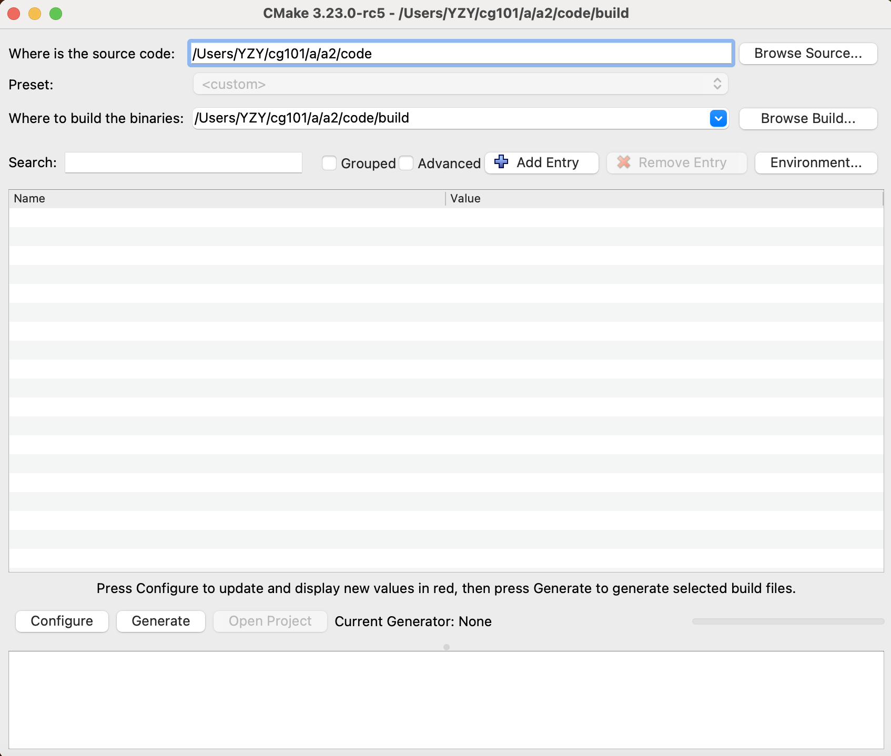
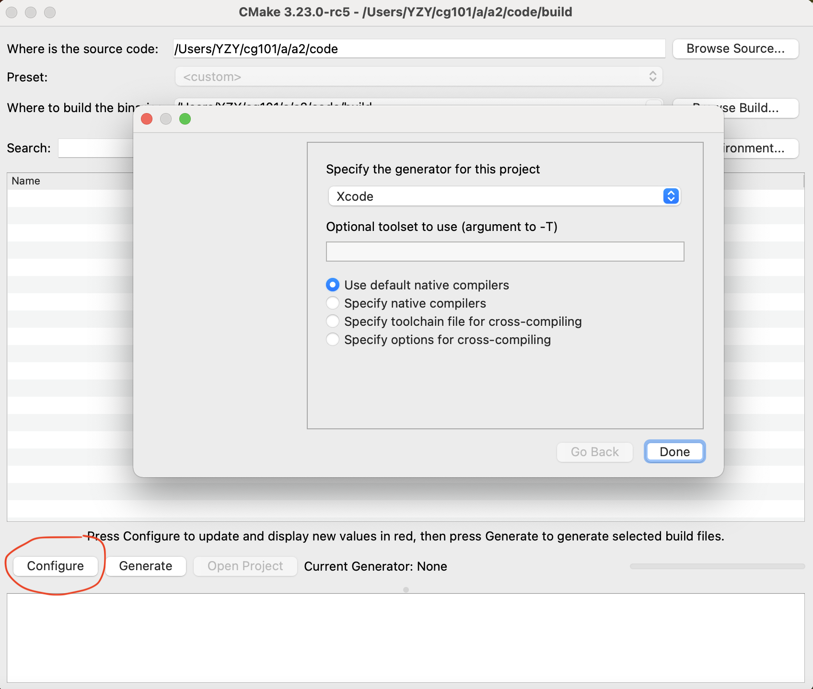
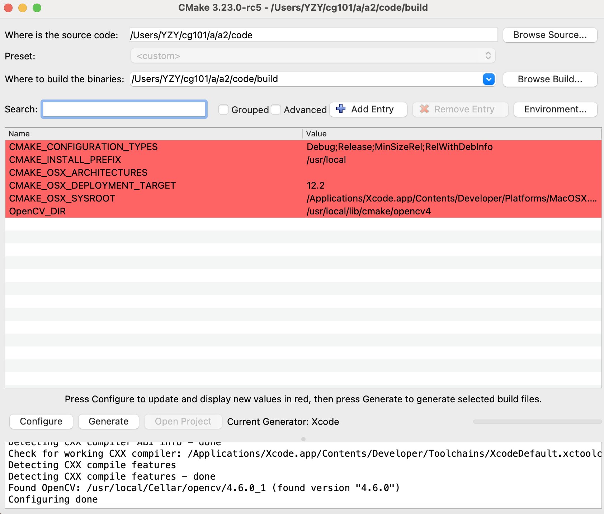
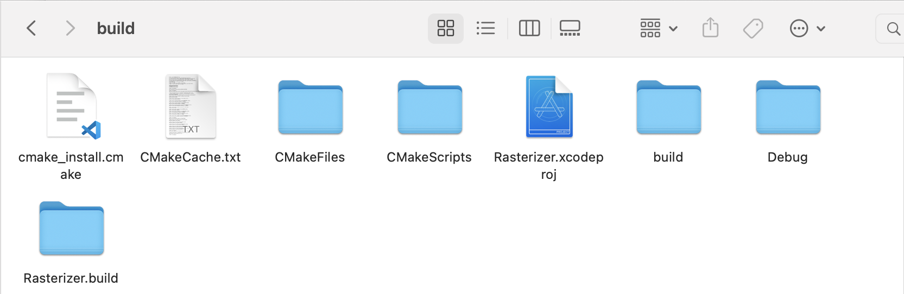

## 简介
  该文档主要介绍了如何利用Cmake工具，将cmake工程转为Xcode工程。
## 前提
1. 安装Cmake、Xcode
2. 安装工程中用到的库

## 具体做法
1. 打开Cmake软件,在Where is the source code一栏中确定源代码所在文件夹，在Where to build the binaries一栏中确定工程构建位置，通常在源代码文件夹中新建build文件夹作为工程的构建位置。

2. 点击左下角的configure,第一行选择Xcode生成器，其它默认，点击done完成配置。

3. 点击done后，等待片刻，下方终端显示Configuring done时代表配置完成，点击configure旁边的Generate。

4. 此时build文件夹下就会出现生成好的Xcode工程，打开即可。 